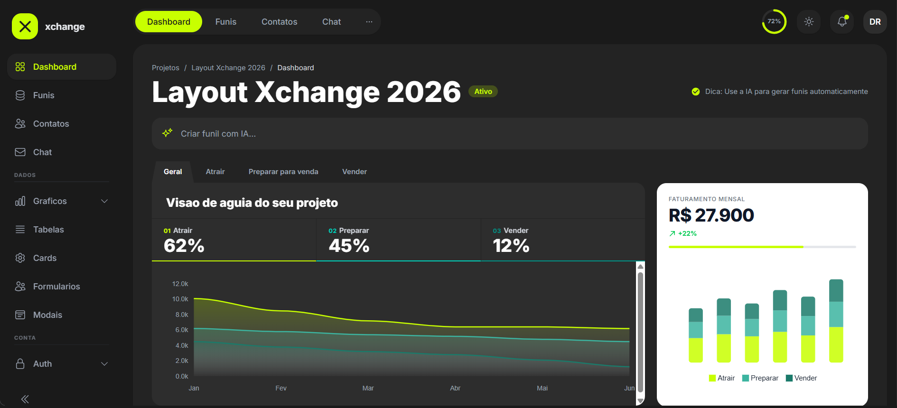
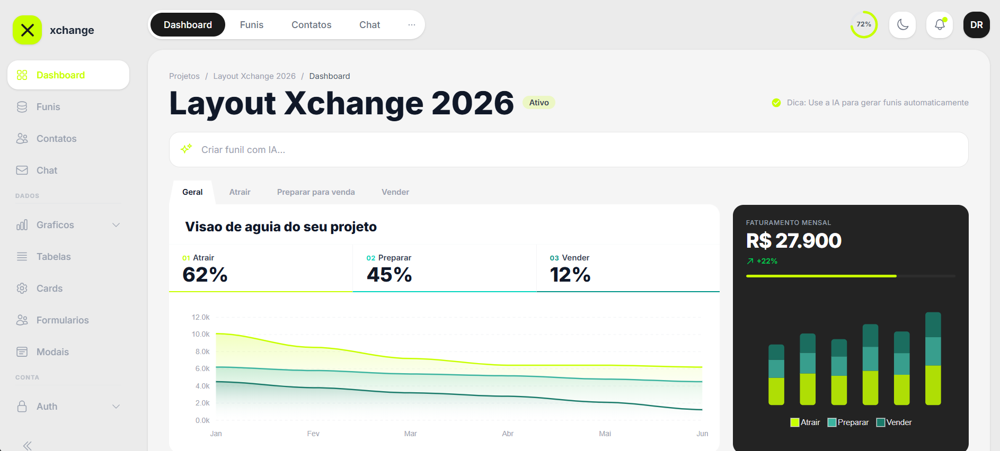

# Xchange - Angular Admin Template

Template admin moderno construido com **Angular 19**, **Tailwind CSS v4** e **Spartan UI**. Design limpo com suporte completo a dark mode, componentes reutilizaveis e layout responsivo.

## Preview

### Dark Mode


### Light Mode


## Stack

- **Angular 19** - Standalone components (sem NgModules)
- **Tailwind CSS v4** - Utility-first styling
- **Spartan UI** - Componentes headless (forms, selects, checkboxes, switches)
- **ApexCharts** - Graficos interativos (area, bar, line, pie)
- **Flatpickr** - Date picker com localizacao PT-BR
- **TypeScript** - Strict mode habilitado

## Paginas

| Pagina | Rota | Descricao |
|--------|------|-----------|
| Dashboard | `/dashboard` | Metricas, graficos de funil, produtos e faturamento |
| Funis | `/funnels` | Stats cards, mapa de conversao, produto e contatos |
| Contatos | `/contacts` | Tabela de contatos com busca e painel de estatisticas |
| Chat | `/chat` | Mensagens em tempo real com lista de contatos e agrupamento por data |
| Graficos | `/charts` | Area, barras, linha e pizza |
| Tabelas | `/tables` | Tabela de transacoes com paginacao e status badges |
| Cards | `/cards` | Galeria de componentes: stats, equipe, produtos, atividade |
| Formularios | `/forms` | Cadastro completo com validacao (Spartan UI + Flatpickr) |
| Modais | `/modais` | Modal basico, confirmacao, alerta, drawer lateral, formulario |
| Login | `/login` | Autenticacao com cubo 3D animado e transicao login/signup |
| Sign Up | `/signup` | Criacao de conta com transicao animada |

## Componentes Reutilizaveis

| Componente | Selector | Uso |
|------------|----------|-----|
| Avatar | `app-avatar` | Iniciais com variantes (default, inverted, accent), tamanhos e formas |
| Page Header | `app-page-header` | Titulo + subtitulo + slot para acoes |
| Search Input | `app-search-input` | Input de busca com icone de lupa |
| Data Table | `app-data-table` | Tabela generica com colunas configuraveis, templates customizaveis e paginacao |
| Card Container | `app-card` | Card wrapper com variantes (default, inverted) e padding configuravel |
| Modal Wrapper | `app-modal-wrapper` | Modal/drawer com backdrop, header e close button |
| Tab Menu | `app-tab-menu` | Tabs navegaveis com expansao animada |
| Stats Card | `app-stats-card` | Card de metrica com trend indicator |
| Contacts Panel | `app-contacts-panel` | Painel de estatisticas de contatos |
| Product Card | `app-product-card` | Card de produto com metricas de conversao |

## Layout

- **Sidebar** - Menu lateral colapsavel com scroll, icones e dropdowns
- **Header** - Tab menu animado, ring de progresso, dark mode toggle, notificacoes
- **Mobile** - Bottom dock com navegacao rapida, sidebar drawer, hamburger menu

## Quick Start

```bash
# Instalar dependencias
cd template-arca
npm install

# Servidor de desenvolvimento
npm start
# Acesse http://localhost:4200

# Build de producao
npm run build
```

## Estrutura

```
src/app/
  components/     # Componentes reutilizaveis (avatar, card, table, modal, etc.)
  layout/         # Sidebar, header, main-layout
  pages/          # Paginas da aplicacao
  services/       # ThemeService (dark mode)
```

## Tema

As cores do tema sao definidas em `src/styles.scss`:

| Token | Light | Dark |
|-------|-------|------|
| `lime-accent` | #C8FF00 | #C8FF00 |
| `lime-accent-text` | #65a30d | #C8FF00 |
| `dark` | #1A1A1A | - |
| `dark-card` | #232323 | - |
| `dark-lighter` | #2D2D2D | - |
| `gray-bg` | #EBEBEB | - |
| `gray-card` | #F5F5F5 | - |

## License

MIT
